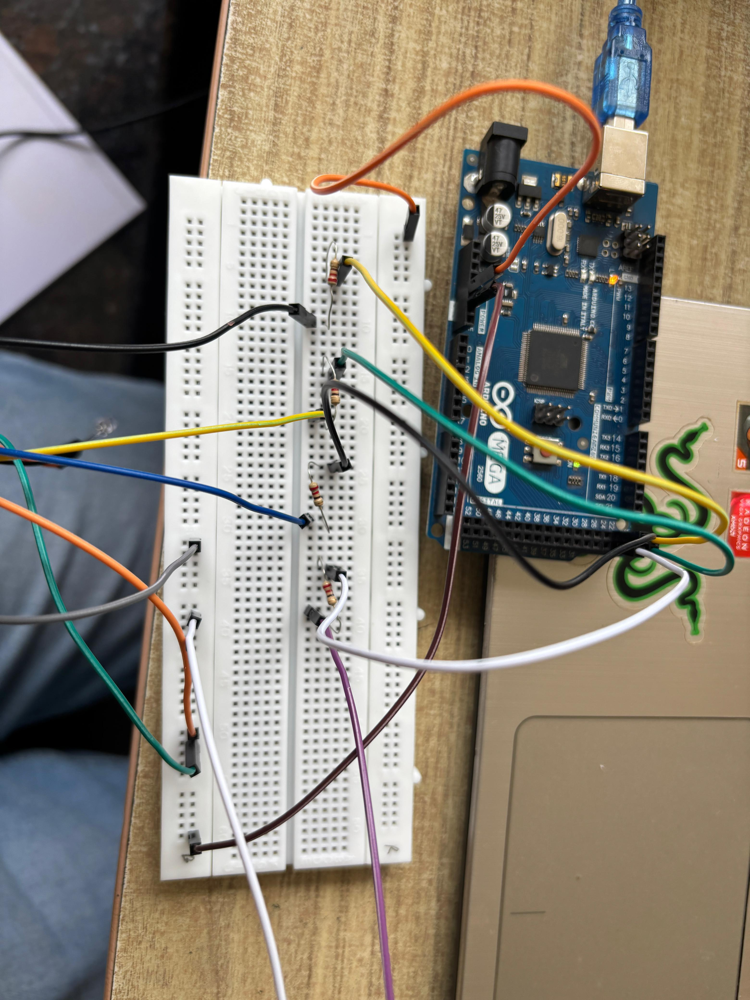

# Voice-Controlled Arduino Smart Home System

A personalized voice recognition system that identifies individual users by their voice patterns and controls Arduino-connected devices based on voice commands. The system can distinguish between different users and execute personalized actions.

## Features

- **Speaker Identification**: Recognizes individual users by their unique voice patterns
- **Voice Command Recognition**: Processes natural language commands like "turn on" and "turn off"
- **Personalized Control**: Different users can control different sets of devices
- **Audio Feedback**: Text-to-speech confirmation of executed commands
- **Real-time Processing**: Live audio recording and immediate response

## Project Setup



## System Architecture

```
User Voice Input → Audio Recording → Speaker Identification → Command Recognition → Arduino Control
                                           ↓
                                    Voice Profile Matching
```

## Hardware Requirements

- Arduino Mega 2560 (or compatible board)
- LEDs (4 total - 2 per user)
- Buzzer for audio feedback
- USB cable for serial communication
- Jumper wires and breadboard

### Pin Configuration

- **Saif's LEDs**: Pins 22, 23
- **Aisha's LEDs**: Pins 24, 25
- **Buzzer**: Pin 26

## Software Requirements

### Python Dependencies

- Python 3.7+
- PySerial for Arduino communication
- SpeechRecognition for command processing
- PyAudio for audio recording
- Pyttsx3 for text-to-speech
- NumPy for audio processing
- SoundDevice for audio capture
- SoundFile for audio file handling
- Resemblyzer for voice embeddings

### Arduino IDE

- Arduino IDE 1.8+ or 2.0+

## Installation

1. **Clone the repository**
```bash
git clone https://github.com/yourusername/voice-controlled-arduino.git
cd voice-controlled-arduino
```

2. **Install Python dependencies**
```bash
pip install -r requirements.txt
```

3. **Upload Arduino code**
   - Open `arduino_code/onofflight/onofflight.ino` in Arduino IDE
   - Select your board (Arduino Mega 2560)
   - Select the correct COM port
   - Upload the sketch

4. **Set up voice profiles**
   - Record voice samples for each user
   - Save as WAV files in `voicecontrol/voices/` directory
   - Name them as `username.wav` (e.g., `saif.wav`, `aisha.wav`)

## Project Structure

```
voice-controlled-arduino/
│
├── arduino_code/
│   └── onofflight/
│       └── onofflight.ino      # Arduino firmware
│
├── voicecontrol/
│   ├── voices/                 # User voice profiles
│   │   ├── saif.wav
│   │   └── aisha.wav
│   ├── resemblyzer/            # Voice encoding module
│   │   ├── __init__.py
│   │   ├── audio.py
│   │   └── voice_encoder.py
│   └── voice_led_with_tts.py  # Main control script
│
├── requirements.txt            # Python dependencies
├── LICENSE                     # Project license
└── README.md                   # This file
```

## Usage

1. **Ensure Arduino is connected** to your computer via USB

2. **Update COM port** in `voice_led_with_tts.py`:
```python
arduino = serial.Serial('COM9', 9600)  # Change COM9 to your port
```

3. **Run the main script**:
```bash
cd voicecontrol
python voice_led_with_tts.py
```

4. **Voice Commands**:
   - Say "Turn on" to activate your assigned LEDs
   - Say "Turn off" to deactivate your assigned LEDs
   - Say "Exit" to close the program

## How It Works

1. **Audio Recording**: The system continuously listens for 3-second audio clips
2. **Speaker Identification**: Compares the voice with stored profiles using voice embeddings
3. **Command Recognition**: Uses Google Speech Recognition to convert speech to text
4. **Action Execution**: Sends commands to Arduino based on identified user and command
5. **Feedback**: Provides audio confirmation through text-to-speech

## Configuration

### Adding New Users

1. Record a clear voice sample (3-5 seconds)
2. Save as `voicecontrol/voices/username.wav`
3. Update Arduino code to add LED pins for the new user
4. Modify the Python script to include the new user profile

### Adjusting Recognition Parameters

In `voice_led_with_tts.py`:
- Recording duration: `duration=3` in `record_audio()`
- TTS speed: `engine.setProperty('rate', 160)`
- Sample rate: `fs = 16000`

## Troubleshooting

### Common Issues

1. **Serial Port Error**
   - Ensure the correct COM port is specified
   - Check Arduino is properly connected
   - Close other programs using the serial port

2. **Voice Not Recognized**
   - Ensure microphone is working
   - Record in a quiet environment
   - Check voice profile quality

3. **Commands Not Working**
   - Verify Arduino code is uploaded
   - Check serial baud rate (9600)
   - Ensure LEDs are properly connected

## Future Enhancements

- [ ] Web interface for remote control
- [ ] Mobile app integration
- [ ] Multiple command support
- [ ] Voice training interface
- [ ] Database for voice profiles
- [ ] Support for more devices (motors, relays, etc.)
- [ ] Multi-language support

## Contributing

Contributions are welcome! Please feel free to submit a Pull Request.

1. Fork the repository
2. Create your feature branch (`git checkout -b feature/AmazingFeature`)
3. Commit your changes (`git commit -m 'Add some AmazingFeature'`)
4. Push to the branch (`git push origin feature/AmazingFeature`)
5. Open a Pull Request

## License

This project is licensed under the MIT License - see the [LICENSE](LICENSE) file for details.

## Acknowledgments

- Arduino community for hardware support
- Google Speech Recognition API
- Python speech processing libraries

## Contact

For questions or support, please open an issue on GitHub.

---
**Note**: This project is for educational purposes. Ensure you have proper consent before recording and storing voice data.